Cellulose addition experiment
================

## sample summary

Soil samples were collected along a treeline in northwest Alaska, in the
western brooks range near the agashashok river. Roughly 60 5cm diameter
cores were take between 10-15 cm (only organic horizon was taken).The
soil was homogenized and frozen for shipment to Toledo Ohio. In Toledo
soils were thawed, further homogenized and kept at 4 °C for roughly a
week. Soil subsamples were placed in mesocosms and cellobiose,
cellotetraose, cellulose-20, cellulose-90, and coloidal cellulose were
added in equal amounts being careful to keep soil moisture constant.
Soils were then incubated at -6, -2, 2 , 6, 10 °C for several months.
During the incubation respiration was measured and at the end of the
incubation soils were destructively harvested for K2SO4/FUM and MPLEx
extractions, and sub samples were used to measure enzyme activity. Below
is the data.

## Respiration results

click to open

Respiration measurements were taken daily during the incubation using a
Li-850 bench top respiration unit. Below are the respiration rates for
each sample, as well as the calculates accumulative respiration rates.

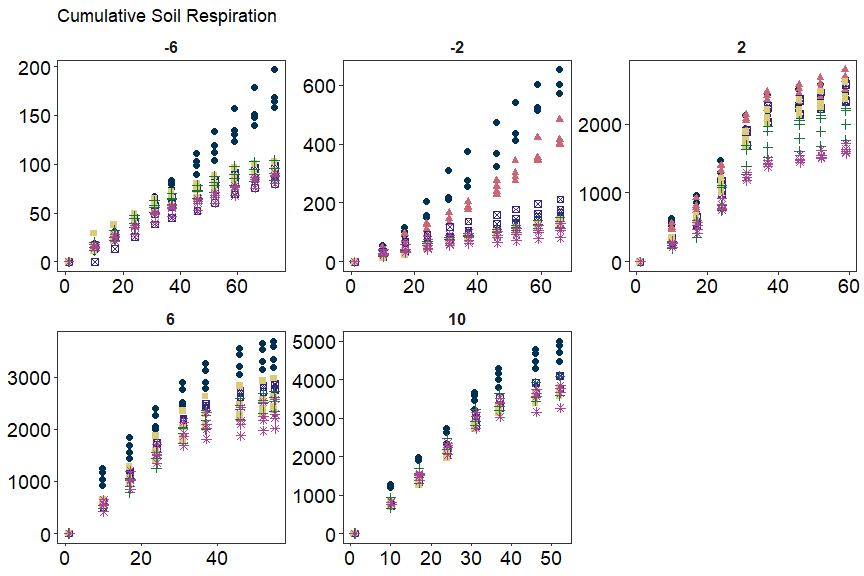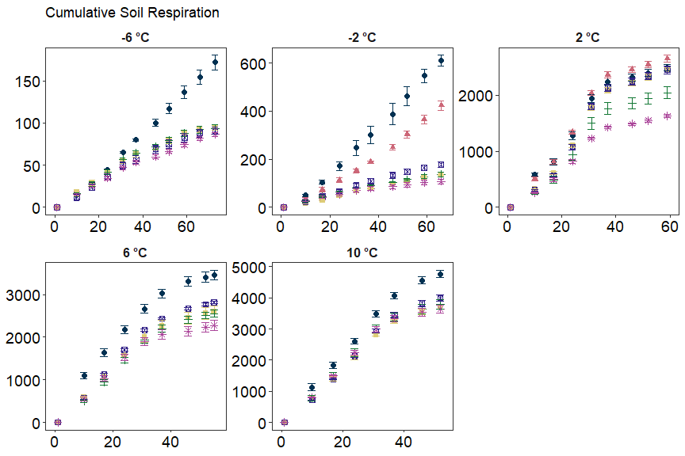

------------------------------------------------------------------------

## Soil Nutrients

click to open

Soil K2SO4 extracts were utilized to measure ammonium, Nitrate, Total
free primary amines, phosphate, Total reducing sugars. Below is the
concentration data.

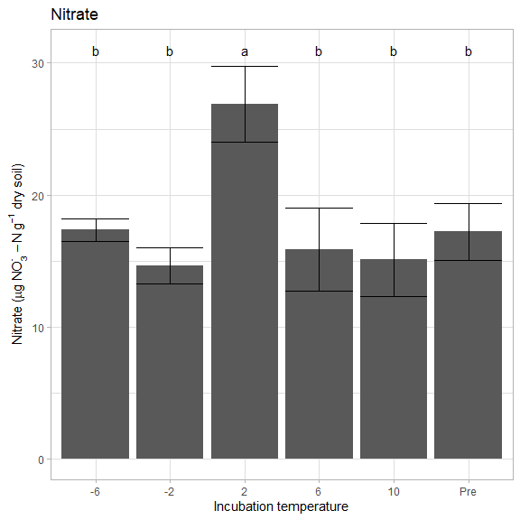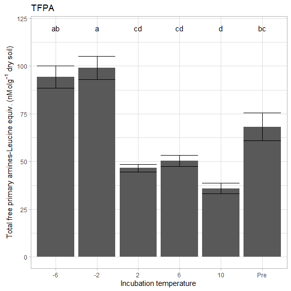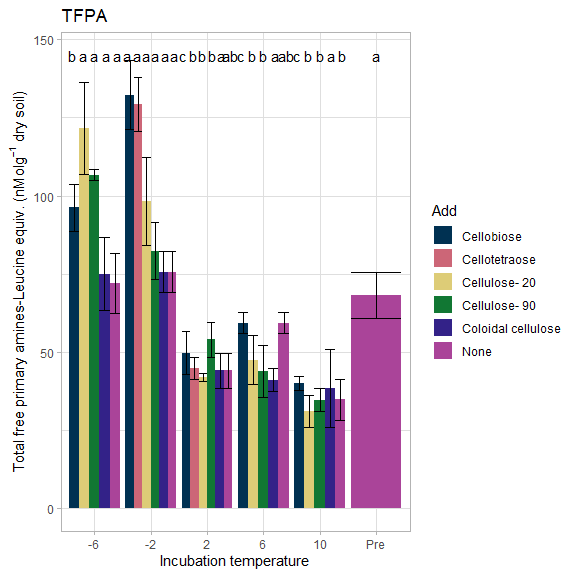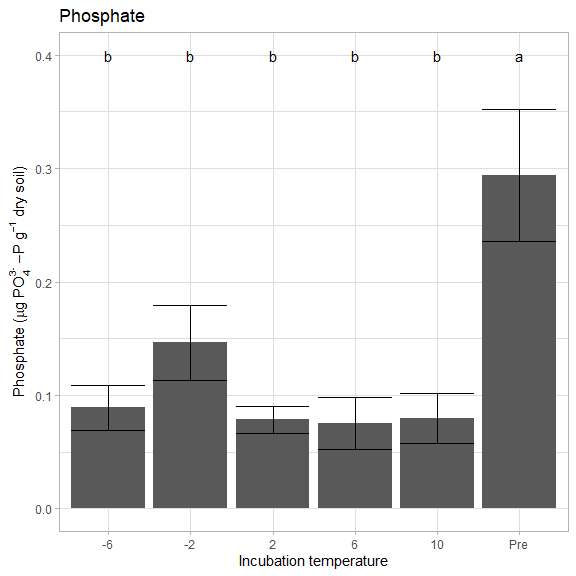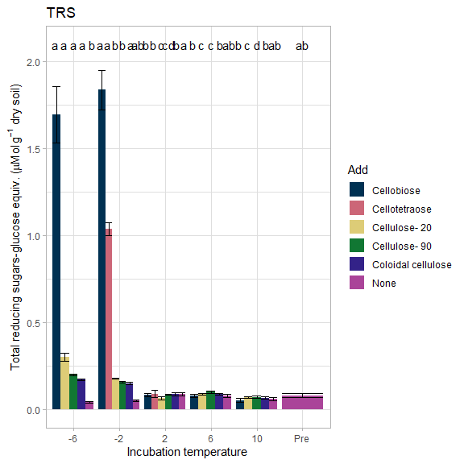

------------------------------------------------------------------------

## Microbial biomass

click to open

Soil K2SO4 extracts and fumigated K2SO4 extracts were utilized to
measure microbial biomass in the soils at the end of the incubation.

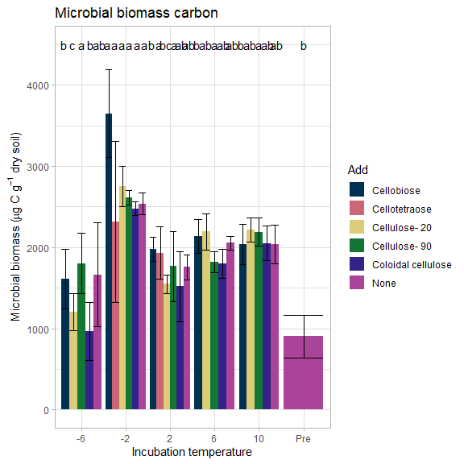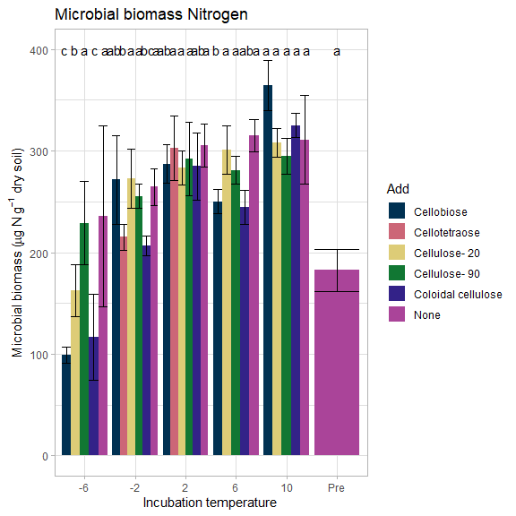

------------------------------------------------------------------------

## Enzyme data

click to open

### Cellulases and hemicellulases

click to open

Cellulases and hemicellulase activity. This includes several downstream
enzymes as well as upstream endo enzymes.

### Nutrient and oxidative enzymes

click to open

Nutrient (nitrogen and phosphorus) acquiring enzyme activity

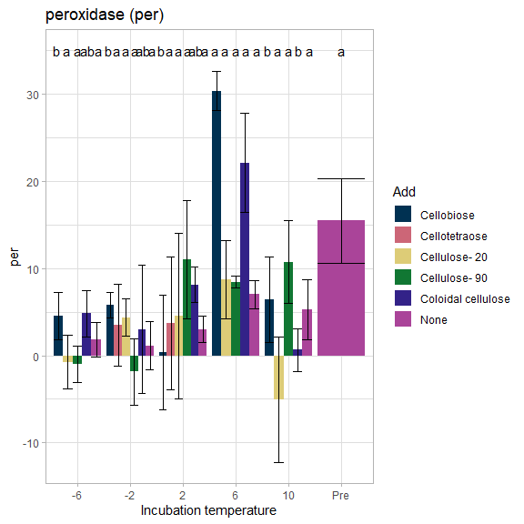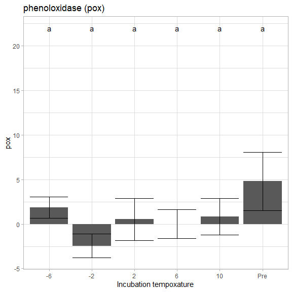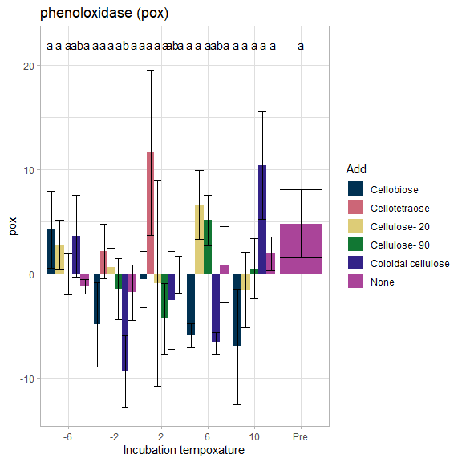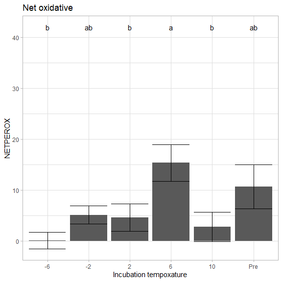

### Enzyme metrics

click to open

several calculated metrics

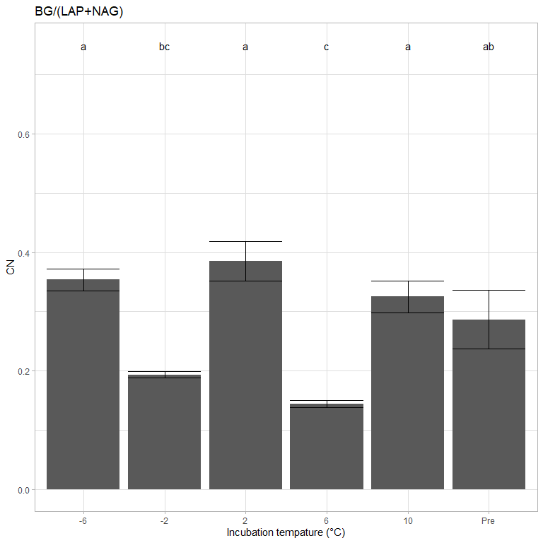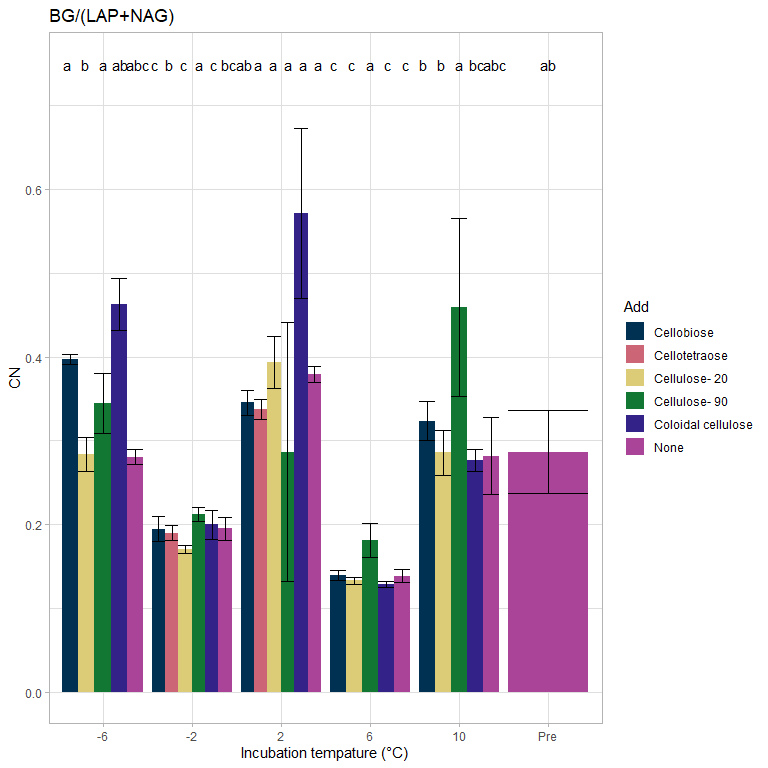

------------------------------------------------------------------------

## Estimated historic soil temperatures

click to open

Soil temperature estimates were constructed by correlating several years
of soil measurements to air temperatures from Kotzebue AK. Then using
this relationship soil temperature estimates were constructed from the
years before soil measurements were taken.

## Session Info

Session Info

Date run: 2023-02-02

    ## R version 4.2.2 (2022-10-31 ucrt)
    ## Platform: x86_64-w64-mingw32/x64 (64-bit)
    ## Running under: Windows 10 x64 (build 19045)
    ## 
    ## Matrix products: default
    ## 
    ## locale:
    ## [1] LC_COLLATE=English_United States.utf8 
    ## [2] LC_CTYPE=English_United States.utf8   
    ## [3] LC_MONETARY=English_United States.utf8
    ## [4] LC_NUMERIC=C                          
    ## [5] LC_TIME=English_United States.utf8    
    ## 
    ## attached base packages:
    ## [1] grid      stats     graphics  grDevices utils     datasets  methods  
    ## [8] base     
    ## 
    ## other attached packages:
    ##  [1] lubridate_1.9.0   timechange_0.1.1  doBy_4.6.16       ggpubr_0.5.0     
    ##  [5] pracma_2.4.2      reshape2_1.4.4    ggbiplot_0.55     scales_1.2.1     
    ##  [9] plyr_1.8.8        vegan_2.6-4       lattice_0.20-45   permute_0.9-7    
    ## [13] forcats_0.5.2     stringr_1.5.0     dplyr_1.0.10      purrr_1.0.0      
    ## [17] readr_2.1.3       tidyr_1.2.1       tibble_3.1.8      ggplot2_3.4.0    
    ## [21] tidyverse_1.3.2   tarchetypes_0.7.4 targets_0.14.2   
    ## 
    ## loaded via a namespace (and not attached):
    ##  [1] nlme_3.1-160         fs_1.5.2             httr_1.4.4          
    ##  [4] future.callr_0.8.1   Deriv_4.1.3          tools_4.2.2         
    ##  [7] backports_1.4.1      utf8_1.2.2           R6_2.5.1            
    ## [10] DBI_1.1.3            mgcv_1.8-41          colorspace_2.0-3    
    ## [13] withr_2.5.0          tidyselect_1.2.0     processx_3.8.0      
    ## [16] compiler_4.2.2       cli_3.6.0            rvest_1.0.3         
    ## [19] microbenchmark_1.4.9 xml2_1.3.3           labeling_0.4.2      
    ## [22] callr_3.7.3          digest_0.6.31        rmarkdown_2.19      
    ## [25] htmltools_0.5.4      pkgconfig_2.0.3      parallelly_1.34.0   
    ## [28] highr_0.10           fastmap_1.1.0        dbplyr_2.2.1        
    ## [31] rlang_1.0.6          readxl_1.4.1         rstudioapi_0.14     
    ## [34] farver_2.1.1         generics_0.1.3       jsonlite_1.8.4      
    ## [37] car_3.1-1            googlesheets4_1.0.1  magrittr_2.0.3      
    ## [40] Matrix_1.5-1         Rcpp_1.0.9           munsell_0.5.0       
    ## [43] fansi_1.0.3          abind_1.4-5          lifecycle_1.0.3     
    ## [46] furrr_0.3.1          stringi_1.7.8        yaml_2.3.6          
    ## [49] carData_3.0-5        MASS_7.3-58.1        parallel_4.2.2      
    ## [52] listenv_0.9.0        crayon_1.5.2         haven_2.5.1         
    ## [55] splines_4.2.2        hms_1.1.2            knitr_1.41          
    ## [58] ps_1.7.2             pillar_1.8.1         igraph_1.3.5        
    ## [61] ggsignif_0.6.4       base64url_1.4        codetools_0.2-18    
    ## [64] reprex_2.0.2         glue_1.6.2           evaluate_0.19       
    ## [67] data.table_1.14.6    modelr_0.1.10        vctrs_0.5.1         
    ## [70] tzdb_0.3.0           cellranger_1.1.0     gtable_0.3.1        
    ## [73] future_1.30.0        assertthat_0.2.1     xfun_0.36           
    ## [76] broom_1.0.2          rstatix_0.7.2        googledrive_2.0.0   
    ## [79] gargle_1.2.1         cluster_2.1.4        globals_0.16.2      
    ## [82] ellipsis_0.3.2

