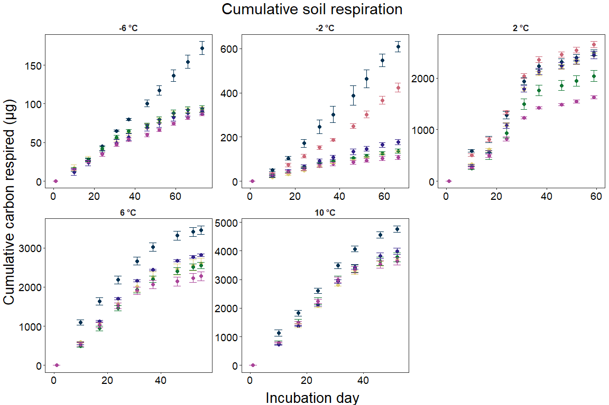
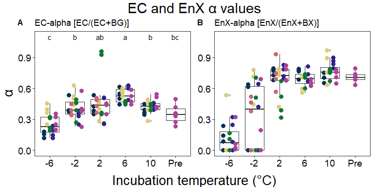
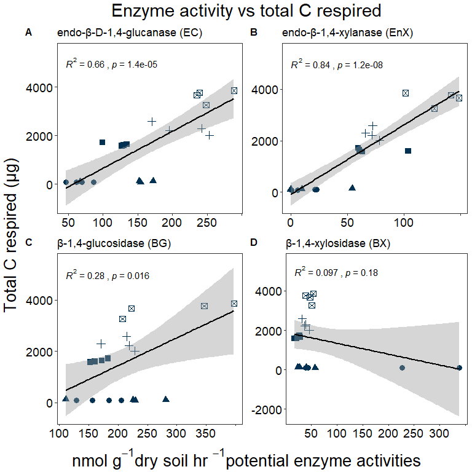
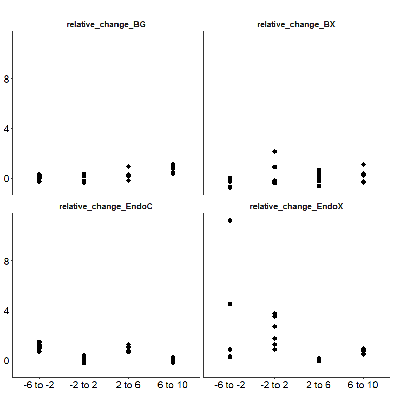
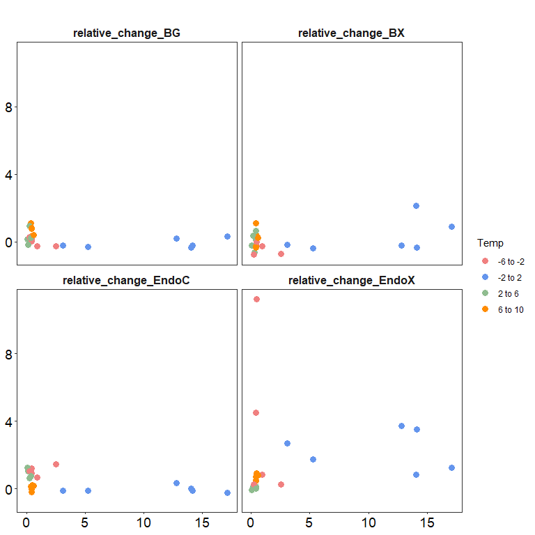
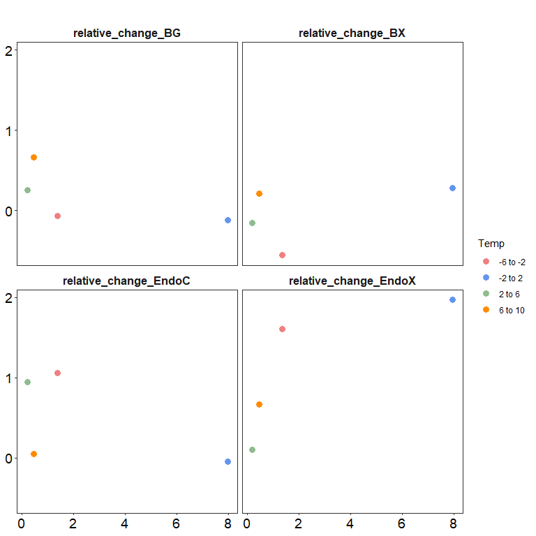
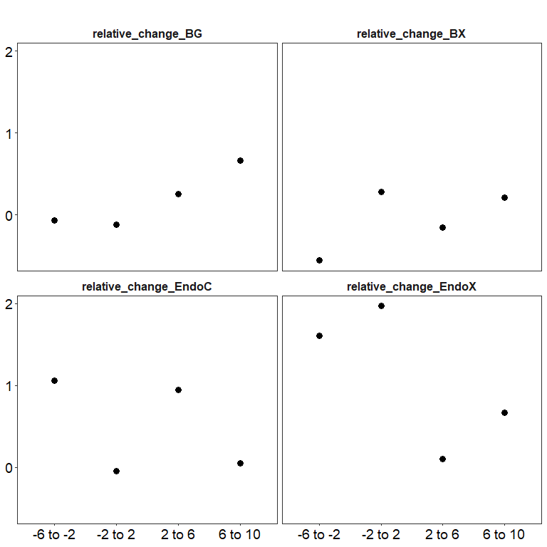
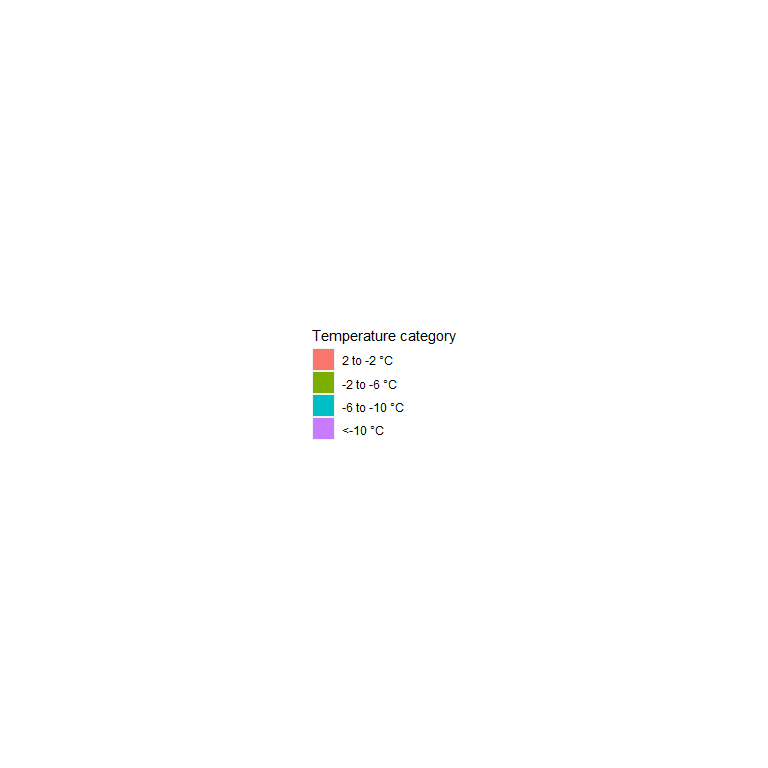

Temperature threshold figures
================

## Respiration results

click to open

------------------------------------------------------------------------

## Enzyme data

click to open

click to open

<!-- --><!-- --><!-- -->

### Enzyme metrics

click to open

## With only controls

## With Color and All data

------------------------------------------------------------------------

## Estimated historic soil temperatures

click to open

## Session Info

Session Info

Date run: 2024-09-06

    ## R version 4.3.2 (2023-10-31 ucrt)
    ## Platform: x86_64-w64-mingw32/x64 (64-bit)
    ## Running under: Windows 11 x64 (build 22631)
    ## 
    ## Matrix products: default
    ## 
    ## 
    ## locale:
    ## [1] LC_COLLATE=English_United States.utf8 
    ## [2] LC_CTYPE=English_United States.utf8   
    ## [3] LC_MONETARY=English_United States.utf8
    ## [4] LC_NUMERIC=C                          
    ## [5] LC_TIME=English_United States.utf8    
    ## 
    ## time zone: America/Los_Angeles
    ## tzcode source: internal
    ## 
    ## attached base packages:
    ## [1] grid      stats     graphics  grDevices utils     datasets  methods  
    ## [8] base     
    ## 
    ## other attached packages:
    ##  [1] lsmeans_2.30-0    emmeans_1.10.0    gridExtra_2.3     cowplot_1.1.1    
    ##  [5] agricolae_1.3-7   doBy_4.6.20       ggpubr_0.6.0      pracma_2.4.4     
    ##  [9] reshape2_1.4.4    ggbiplot_0.55     scales_1.3.0      vegan_2.6-4      
    ## [13] lattice_0.21-9    permute_0.9-7     lubridate_1.9.3   forcats_1.0.0    
    ## [17] stringr_1.5.1     purrr_1.0.2       readr_2.1.4       tidyr_1.3.0      
    ## [21] tibble_3.2.1      ggplot2_3.4.4     tidyverse_2.0.0   dplyr_1.1.4      
    ## [25] plyr_1.8.9        tarchetypes_0.7.9 targets_1.3.2    
    ## 
    ## loaded via a namespace (and not attached):
    ##  [1] tidyselect_1.2.0      farver_2.1.1          fastmap_1.1.1        
    ##  [4] digest_0.6.33         base64url_1.4         timechange_0.2.0     
    ##  [7] estimability_1.5      lifecycle_1.0.4       Deriv_4.1.3          
    ## [10] cluster_2.1.4         processx_3.8.2        magrittr_2.0.3       
    ## [13] compiler_4.3.2        rlang_1.1.2           tools_4.3.2          
    ## [16] igraph_1.5.1          utf8_1.2.4            yaml_2.3.7           
    ## [19] data.table_1.14.8     knitr_1.45            ggsignif_0.6.4       
    ## [22] labeling_0.4.3        abind_1.4-5           withr_2.5.2          
    ## [25] fansi_1.0.5           AlgDesign_1.2.1       xtable_1.8-4         
    ## [28] colorspace_2.1-0      MASS_7.3-60           cli_3.6.1            
    ## [31] mvtnorm_1.2-4         rmarkdown_2.25        generics_0.1.3       
    ## [34] rstudioapi_0.15.0     tzdb_0.4.0            splines_4.3.2        
    ## [37] parallel_4.3.2        vctrs_0.6.4           Matrix_1.6-1.1       
    ## [40] carData_3.0-5         car_3.1-2             callr_3.7.3          
    ## [43] hms_1.1.3             rstatix_0.7.2         glue_1.6.2           
    ## [46] codetools_0.2-19      ps_1.7.5              stringi_1.8.2        
    ## [49] gtable_0.3.4          munsell_0.5.0         pillar_1.9.0         
    ## [52] htmltools_0.5.7       R6_2.5.1              microbenchmark_1.4.10
    ## [55] evaluate_0.23         highr_0.10            backports_1.4.1      
    ## [58] broom_1.0.5           Rcpp_1.0.11           nlme_3.1-163         
    ## [61] mgcv_1.9-0            xfun_0.41             fs_1.6.3             
    ## [64] pkgconfig_2.0.3

